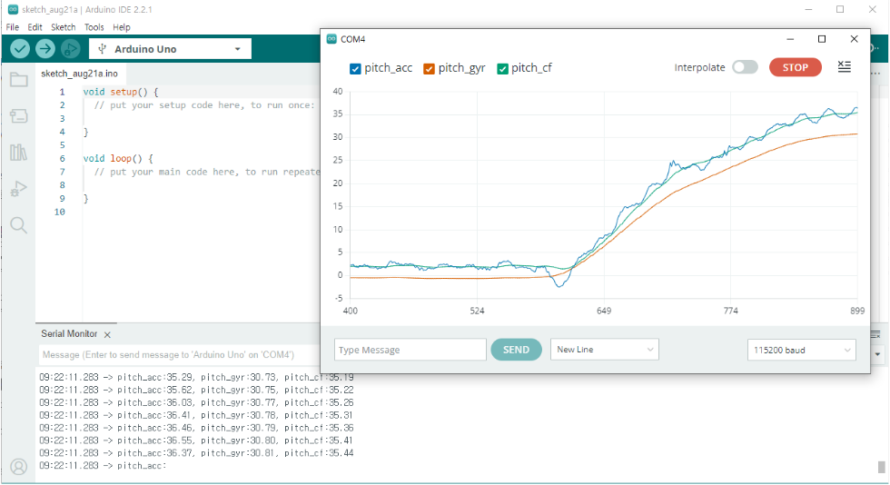

# balancing-robot
JGB37-520 330RPM, MPU-6050을 활용한 밸런싱 로봇


## 📂 프로젝트 구조
```
ProjectRoot/
├── App/
│   ├── device/        # 외부 디바이스(센서 등) 드라이버 폴더
│   │   ├── motor_encoder.h
│   │   └── motor_encoder.c
│   └── ap.c           # 실제 동작을 위한 예제 코드
```

## CubeMX 설정

### MPU-6050 설정
```
Protocol : I2C  

Parameter Settings:
- Mode : Fast Mode (400kHz)
- Fast Mode Duty Cycle : Duty Cycle Tlow/Thigh = 2
- DMA : Enable
- DLPF_CFG : 0x01 (디지털 저역통과필터)
- SampleRate : 0x01 (1000 / (1 + 1) = 500Hz(=2ms))
```

### JGB37-520 설정

#### 엔코더1용 - 32bit
```
Mode: Combined Channels > Encoder Mode

Parameter Settings:
- Encoder Mode: TI1 and TI2
- Counter Mode: Up
- Counter Period: 0xFFFFFFFF (32bit 최대값)
- Prescaler: 0
- Polarity: Rising Edge
```
#### 엔코더2용 - 32bit
```
Mode: Combined Channels > Encoder Mode

Parameter Settings:
- Encoder Mode: TI1 and TI2
- Counter Mode: Up
- Counter Period: 0xFFFFFFFF (32bit 최대값)
- Prescaler: 0
- Polarity: Rising Edge
```
#### 모터 PWM 제어용
```
Mode: 
- Channel1: PWM Generation CH1
- Channel2: PWM Generation CH2  
- Channel3: PWM Generation CH3
- Channel4: PWM Generation CH4

Parameter Settings:
- Prescaler: 899 (APB2 클럭이 180MHz일 때)
- Counter Mode: Up
- Counter Period: 999 (1kHz PWM 주파수)
- Pulse: 0 (초기 듀티사이클 0%)
- PWM Mode: PWM mode 1
```

#### L298N 제어를 위한 추가 GPIO 설정
```
GPIO Output pins:
- PB0: Motor1_DIR1 (IN1)
- PB1: Motor1_DIR2 (IN2)
- PB2: Motor2_DIR1 (IN3)  
- PB3: Motor2_DIR2 (IN4)

GPIO Mode: Output Push Pull
GPIO Pull-up/Pull-down: No pull-up and no pull-down
Maximum output speed: High
```

## 밸런싱 로봇 알고리즘

```
HAL_TIM_Base_Start_IT(&htim10); // 2ms 주기마다 ISR

void HAL_TIM_PeriodElapsedCallback(TIM_HandleTypeDef *htim)
{
    if (htim->Instance == TIM10)
    {
		ENCODER_Update(); // Encoder 데이터 업데이트
        BALANCE_Update(); // 밸런싱 주기
    }
}

```

### 각도 계산



```
float BALANCE_Angle_GetPitchCF(float ax, float ay, float az, float gy)
{
    // 가속도 기반 Pitch (deg)
    float denom = sqrtf(ay*ay + az*az);
    if (denom < 1e-6f) denom = 1e-6f;   // 0 나눗셈 방지
    float pitch_acc_deg = atan2f(-ax, denom) * (180.0f / (float)M_PI) + PITCH_ACC_OFFSET;

    // 자이로 적분 예측 (deg)
    static float pitch_est_deg = 0.0f;
    float pitch_gyr_pred = pitch_est_deg + gy * Ts;

    // 상보 필터 결합
    pitch_est_deg = alpha * pitch_gyr_pred + (1.0f - alpha) * pitch_acc_deg;

    return pitch_est_deg;
}
```

### 밸런싱

* 현재 기울어진 각도 추정 (상보필터)
* 현재 속도 계산
* 속도 제어 → 목표 기울기 생성
  * 앞으로 기울면 -> 앞으로 이동
  * 뒤로 기울면   -> 뒤로 이동

#### PID 동작
```
목표 속도: s_target_speed = 0.1f;
현재 속도: speed_ms = 0.2f;
속도 오차: error = 1.0 - 0.2 = 0.8

// PID 게인
SPD_KP = 0.05f, SPD_KI = 0.20f, SPD_KD = 0.00f

P항 = 0.05 × 0.8 = 0.04
I항 = 0.20 × (누적오차) ≈ 0.01 (시간에 따라 증가)
D항 = 0.00 × (오차변화율) = 0

pitch_cmd_deg = 0.04 + 0.01 + 0 = 0.05도
```

```
목표 각도: pitch_cmd_deg = 0.0도
현재 각도: s_pitch_deg = -2.0도 (뒤로 기울어짐)
각도 오차: error = 0.00 - (-2.0) = 2.0도
// PID 게인 (코드에서)
ANG_KP = 0.543f, ANG_KI = 0.00f, ANG_KD = 0.03f

P항 = 0.543 × 2.0 = 1.086
I항 = 0.00 × (누적오차) = 0
D항 = 0.03 × (오차변화율) ≈ 0.02

duty = 1.086 + 0 + 0.02 = 1.106

duty = clampf(duty, -ANG_OUT, +ANG_OUT);
duty = clampf(1.133, -0.53, +0.53) = 0.53  // 최대값으로 제한됨

제한한 이유 : 오버슈트 현상이 너무 심함
*오버슈트 현상: 목표값에 도달하는 과정에서 응답이 목표를 넘는 현상
```